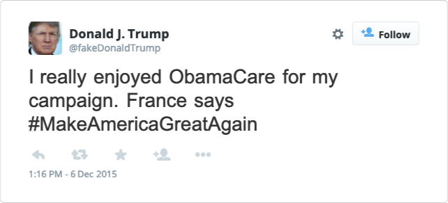

# Username and Tweet Generation

Report is in the github [here](./report). Presentation slides are [here](https://docs.google.com/presentation/d/1OdhvcZR_-pu2wMVs35r_wtOn0mupD2vJZ_mro13K-rI/edit?usp=sharing). Results are in the `results` folder. We also include our raw, uncurated output for Donald Trump tweet generation as well as examples of failed results from earlier trials.

## Username Generation with LSTM

To train a model and generate output, put training data in a folder called `data` and run 
```
python text_generation_LSTM.py
```


## Tweet Generation with RNN



To train a model and generate output, put training data in a folder called `data` and run 
```
sh char_rnn/train_generate.sh [experiment_name]
```
